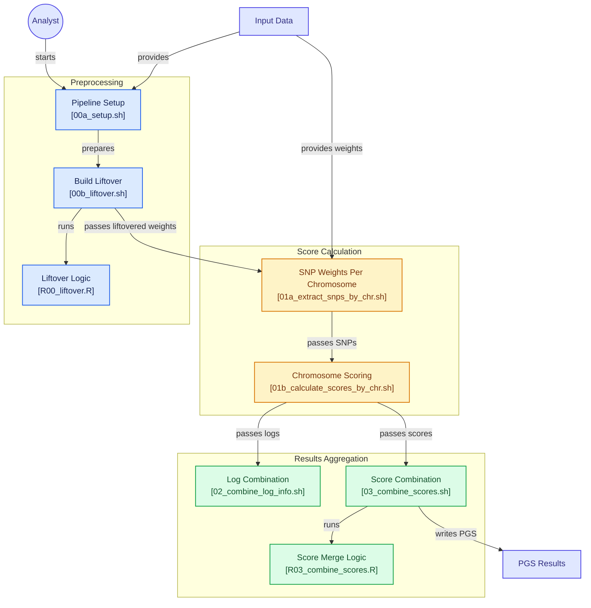

# PGS calculation pipeline

## Overview

This pipeline provides a reproducible workflow for calculating polygenic scores (PGS) from genotype data using externally derived variant weight files. Before running the pipeline, users should execute the setup script, which creates a `data/config.env` file containing the project-specific parameters required by the pipeline. These include the working directory, cohort and phenotype identifiers, the genotype file location and naming pattern, and the path to the PGS weight file. 

Once configured, the pipeline can be executed using the supplied shell and R scripts. It is designed to address common challenges in genomic analyses, including differences in genome builds, chromosome-wise processing of large-scale genetic datasets, and aggregation of chromosome-level results into participant-level scores.

### Some notes:
- At present, the pipeline supports genotype data in VCF format. Users requiring other file formats can adapt the scripts as needed. The default workflow assumes that VCF files are split by chromosome, with one file per chromosome. If genotype data are stored in a different format or organisation, users can adapt the 01b_calculate_scores_by_chr.sh script to match their file structure and naming conventions.

- For studies where the variant weight file is based on the hg19 genome build and the target genotype data are aligned to hg38, an optional liftover step is available. [Liftover](https://github.com/justiina/pgs-calculation/blob/main/00b_liftover.sh) script downloads and extracts the hg19ToHg38 chain file from [UCSC Chain Files](https://hgdownload.soe.ucsc.edu/goldenPath/hg19/liftOver/) and performs coordinate conversion using the liftOver() function from the [rtracklayer](https://bioconductor.org/packages/release/bioc/html/rtracklayer.html) R package. The script can be readily modified to support other genome build conversions when required.

## Workflow
- **Input**: Genotype data and a PGS weight file containing variant effect estimates.
- **Output**: Individual-level polygenic scores and log file containing the number of available and unavailable SNPs.

### 1) Preprocessing
During preprocessing, the pipeline initialises the analysis environment and, when necessary, converts variant build between genome assemblies using a liftover procedure. This ensures that the genomic positions in the PGS weight file are aligned with those used in the target genotype data.

#### Steps
1. Configure the analysis environment by running [00a_setup.sh](https://github.com/justiina/pgs-calculation/blob/main/00a_setup.sh).
2. Add following information to the just created data/config.env file: working directory, cohort abbreviation, phenotype name, genotype data path and file name and PRS weight file.
3. Harmonise genome builds through coordinate liftover when required by [00b_liftover.sh](https://github.com/justiina/pgs-calculation/blob/main/00b_liftover.sh).

### 2) Score Calculation
In the score calculation step, variants contained in the weight file are extracted by chromosome. Polygenic scores are then calculated independently for each chromosome, enabling efficient parallel processing on high-performance computing environments.

#### Steps
1. Extract chromosome-specific variants from the weight file by [01a_extract_snps_by_chr.sh](https://github.com/justiina/pgs-calculation/blob/main/01a_extract_snps_by_chr.sh).
2. Calculate chromosome-level polygenic scores by [01b_calculate_scores_by_chr.sh](https://github.com/justiina/pgs-calculation/blob/main/01b_calculate_scores_by_chr.sh).

### 3) Results Aggregation
Finally, chromosome-specific outputs are combined to generate participant-level polygenic scores. The resulting outputs include the final PGS values together with supporting log files containing the number of available and unavailable SNPs utilised when calculating the scores.

#### Steps
1. Summarise scoring logs by [02_combine_log_info.sh](https://github.com/justiina/pgs-calculation/blob/main/02_combine_log_info.sh).
2. Merge chromosome-level scores into final participant-level PGS results by [R03_combine_scores.R](https://github.com/justiina/pgs-calculation/blob/main/R03_combine_scores.R).

## Flowchart
