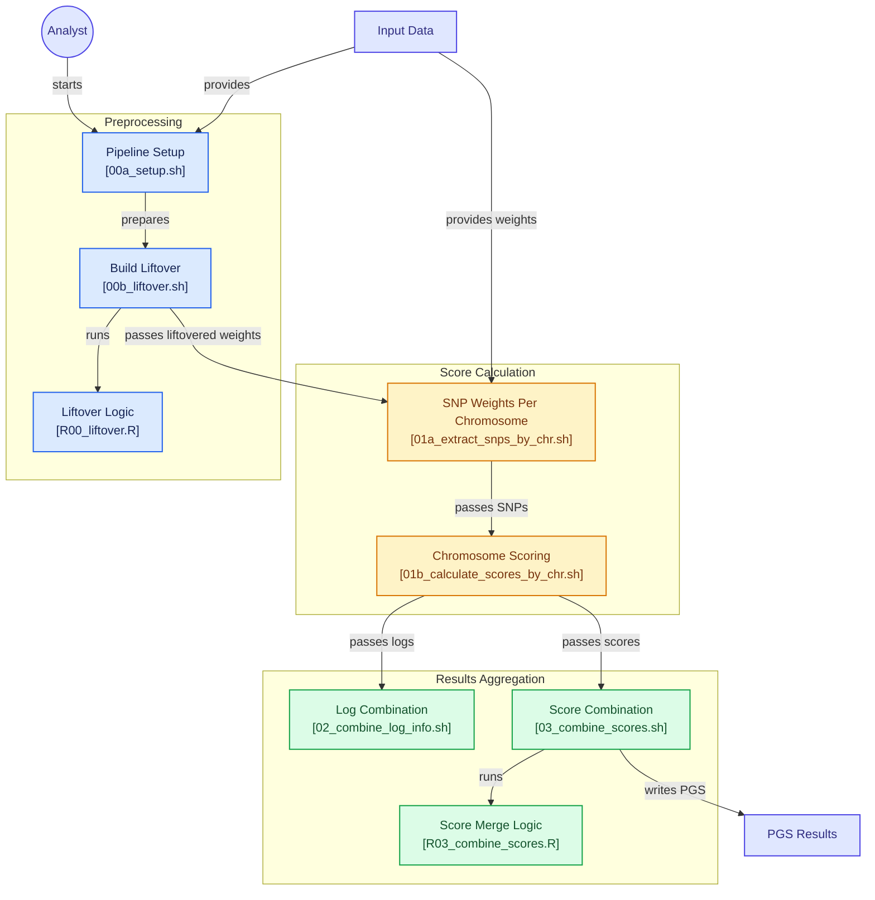

# PGS calculation pipeline

## Overview

This pipeline provides a reproducible workflow for calculating polygenic scores (PGS) from genotype data and externally derived variant weight files. It is designed to handle common challenges encountered in genomic studies, including differences in genome builds, chromosome-wise processing of large genetic datasets, and aggregation of results across chromosomes into participant-level scores. The pipeline is implemented using shell and R scripts and is intended to be flexible across different cohorts and computing environments. By separating preprocessing, scoring, and aggregation into modular components, it enables users to adapt individual steps while maintaining a standardized and reproducible analytical workflow.

## Workflow
- **Input**: Genotype data and a PGS weight file containing variant effect estimates.
- **Output**: Individual-level polygenic scores and log file containing the number of available and unavailable SNPs.

### 1) Preprocessing
During preprocessing, the pipeline initialises the analysis environment and, when necessary, converts variant build between genome assemblies using a liftover procedure. This ensures that the genomic positions in the PGS weight file are aligned with those used in the target genotype data.

  <strong>Steps</strong>
  <ul style="list-style-type: none; padding-left: 0; margin-top: 8px;">
    <li>1.1 Configure the analysis environment.</li>
    <li>1.2 Add following information to the config.env file: working directory, cohort abbreviation, phenotype name, genotype data path and file name and PRS weight file.</li>
    <li>1.3 Harmonise genome builds through coordinate liftover when required.</li>
  </ul>

### 2) Score Calculation
In the score calculation step, variants contained in the weight file are extracted by chromosome. Polygenic scores are then calculated independently for each chromosome, enabling efficient parallel processing on high-performance computing environments.

  <strong>Steps</strong>
  <ul style="list-style-type: none; padding-left: 0; margin-top: 8px;">
    <li>2.1 Extract chromosome-specific variants from the weight file.</li>
    <li>2.2 Calculate chromosome-level polygenic scores in parallel.</li>
  </ul>

### 3) Results Aggregation
Finally, chromosome-specific outputs are combined to generate participant-level polygenic scores. Quality-control metrics and log files produced during the scoring process are aggregated into summary reports, providing transparency regarding variant matching and score calculation performance. The resulting outputs include the final PGS values together with supporting metadata that can be used for downstream statistical analyses.

  <strong>Steps</strong>
  <ul style="list-style-type: none; padding-left: 0; margin-top: 8px;">
    <li>3.1 Summarise scoring logs and quality metrics.</li>
    <li>3.2 Merge chromosome-level scores into final participant-level PGS results.</li>
  </ul>

